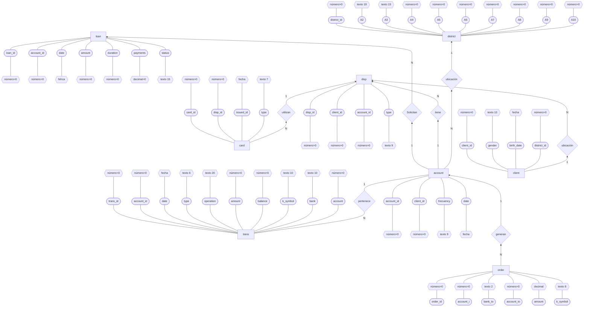

# Tarea 2

## Modelo entidad realción

```mermaid
flowchart BT


    atOR1([order_id]) --- dmOR1{{número>0}} --- order
    atOR2([account_i]) --- dmOR2{{número>0}} --- order 
    atOR3([bank_to]) --- dmOR3{{texto 2}} --- order
    atOR4([account_to]) --- dmOR4{{número>0}} --- order
    atOR5([amount]) --- dmOR5{{decimal}} --- order
    atOR6([k_symbol]) --- dmOR6{{texto 8}} --- order  


    dmLO1{{número>0}} --- atLO1([loan_id]) --- loan 
    dmLO2{{número>0}} --- atLO2([account_id]) --- loan
    dmLO3{{fehca}} --- atLO3([date]) --- loan 
    dmLO4{{número>0}} --- atLO4([amount]) --- loan 
    dmLO5{{número>0}} --- atLO5([duration]) --- loan
    dmLO6{{decimal>0}} --- atLO6([payments]) --- loan 
    dmLO7{{texto 15}}  --- atLO7([status]) --- loan  

    card --- atCD1([card_id]) --- dmCD1{{número>0}}
    card --- atCD2([disp_id]) --- dmCD2{{número>0}}
    card --- atCD3([issued_id]) --- dmCD3{{fecha}}
    card --- atCD4([type]) --- dmCD4{{texto 7}}
    

    dmDISP1{{número>0}} --- atDISP1([disp_id]) --- disp 
    dmDISP2{{número>0}} --- atDISP2([client_id]) --- disp  
    dmDISP3{{número>0}} --- atDISP3([account_id]) --- disp 
    dmDISP4{{texto 9}} --- atDISP4([type]) --- disp 


    trans --- atTS1([trans_id]) --- dmTS1{{número>0}}
    trans --- atTS2([account_id]) --- dmTS2{{número>0}}
    trans --- atTS3([date]) --- dmTS3{{fecha}}
    trans --- atTS4([type]) --- dmTS4{{texto 6}}
    trans --- atTS5([operation]) --- dmTS5{{texto 20}}
    trans --- atTS6([amount]) --- dmTS6{{número>0}}
    trans --- atTS7([balance]) --- dmTS7{{número>0}}
    trans --- atTS8([k_symbol]) --- dmTS8{{texto 10}}
    trans --- atTS9([bank]) --- dmTS9{{texto 10}}
    trans --- atTS10([account]) --- dmTS10{{número>0}}
             
    dmACC1{{número>0}} --- atACC1([account_id]) --- account
    dmACC2{{número>0}} --- atACC2([client_id]) --- account
    dmACC3{{texto 9}} --- atACC3([frecuency]) --- account
    dmACC4{{fecha}} --- atACC4([date]) --- account 
      

    district --- atDIS1([district_id]) --- dmDIS1{{número>0}}
    district --- atDIS2([A2]) --- dmDIS2{{texto 19}}
    district --- atDIS3([A3]) --- dmDIS3{{texto 15}}
    district --- atDIS4([A4]) --- dmDIS4{{número>0}}
    district --- atDIS5([A5]) --- dmDIS5{{número>0}}
    district --- atDIS6([A6]) --- dmDIS6{{número>0}}
    district --- atDIS7([A7]) --- dmDIS7{{número>0}}
    district --- atDIS8([A8]) --- dmDIS8{{número>0}}
    district --- atDIS9([A9]) --- dmDIS9{{número>0}}
    district --- atDIS10([A10]) --- dmDIS10{{número>0}}


    client --- atCL1([client_id]) --- dmCL1{{número>0}}
    client --- atCL2([gender]) --- dmCL2{{texto 10}}
    client --- atCL3([birth_date]) --- dmCL3{{fecha}}
    client --- atCL4([district_id]) --- dmCL4{{número>0}}


    trans --- |N| account_id2{pertenece} --- |1| account
    card -->|N| disp_id{utilizan} -->|1| disp
    client -->|1| client_id{ubicación} --->|N| disp
    order --->|N| order_id{generan} --->|1| account
    account --->|1| account_id{Solicitan} ---->|N| loan
    account --->|1| account_id1{tiene} --> |N|disp
    account ----> |N| district_id{ubicación} ---> |1|district
```