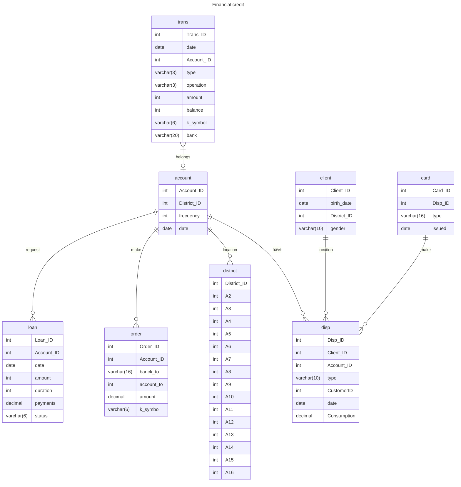

# Tarea 3

## PARTE 1
### 
 ESQUEMA DE MODELO RELACIONAL 

* account(*Account_ID*, *District_ID*, frecuency, date)
* client(*Account_ID*, *Client_ID*, *District_ID*, gender, birth_date)
* trans(*Trans_ID*, date, typpe, operation, amount, balance, k_symbol, bank, account)
* disp(*Client_ID*, *Disp_ID*, account_ID, type)
* card(*Disp_ID*, *Card_ID*, type, issued)
* loan(*Loan_ID*, *Account_ID*, amount, k_symbol)
* order(*Order_ID*, *Account_ID*, bank_to, account_to, amount, k_symbol)
* district(*District_ID*, A2, A3, A4, A5, A6, A7, A8, A9, A10, A11, A12, A13, A14, A15, A16)

## PARTE 2
### 
 MODELO RELACIÓN 

## PARTE 3 
### 
 OPERACIONES DE ALGEBRA RELACIONAL 

1. . Obtener el ID de los clientes mayores a 30 años

*∏* Client_ID(*σ* birth_date < 01/01/1990(Client))

Se condiciono a que la fecha de nacimiento sea menor que 01/01/1990, contemplado que la BD es hasta el 2020 y se proyecta el clientID del resultado

2. Obtener el District_ID de los prestamos > x

*∏* district(*σ* paymentes > x(loan))

Se proyecta el ID de las localidades cuando el valor de prestamos sea mayor a X

3. Obtener las ordenes cuando la fecha de trasacciones  < x 

*∏* Order_ID[ *∏* Account_ID( *σ* trans.date < XX/XX/XXXX (account)).Account_ID(trans*account)]

Se proyecta los ID de las ordenes que tienen una fecha de transación < x

4. Obtener clientes de genero femenino

*∏* client(*σ* gender = "Female" (client))

Se proyecta los clientes femeninos